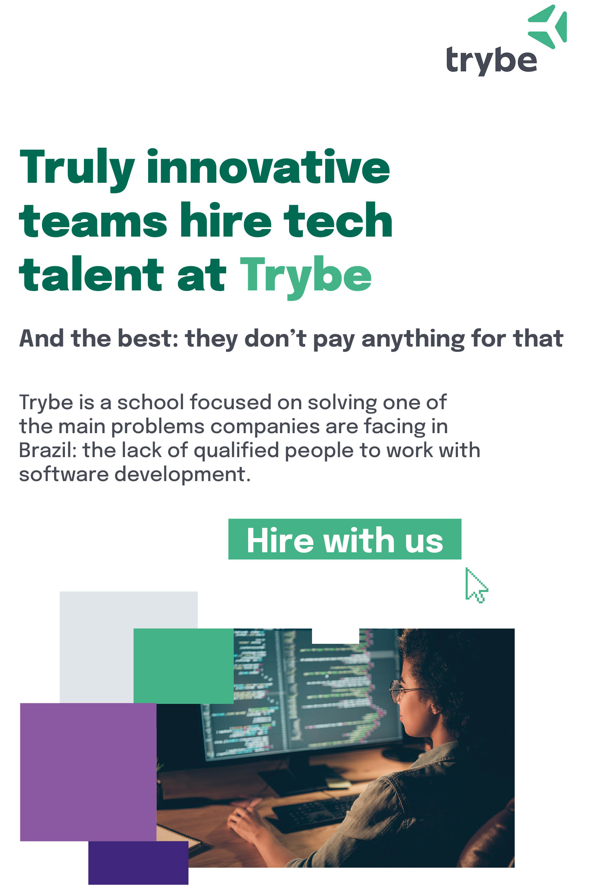

{width=60%}

* **Name**: Otavio Santana
* **Job Title**: Staff Engineer
* **Bio:** Empowering developers worldwide to deliver better software faster, scalable in the Cloud. Otavio is a passionate software engineer focused on Cloud and Java technology. He has experience mainly in persistence polyglot and high-performance applications in finances, social media, and e-commerce. Otavio is a member of both Expert Groups and Expert Leader in several JSRs and JCP executive committee. He is working on several Apache and Eclipse Foundation projects such as Apache Tamaya, MicroProfile, Jakarta EE, where he is leading the first specification at Jakarta EE with Jakarta NoSQL. A JUG leader and global speaker at JavaOne and Devoxx conferences. Otavio has received recognition for his OSS contributions such as the JCP Outstanding Award, Member of the year and innovative JSR, Duke’s Choice Award, and Java Champion Award, to name a few.

  {pagebreak}

{width=60%}

* **Name**: Sérgio Lopes

* **Job Title**: IT Specialist in Banco Itaú S/A

* **Bio:** C++ Developer, Java Developer, Software Enginner, IT Specialist in backend. Working in one of the most robust Internet Banking in Latin America. Acting in the creation of the development framework called *Universal*, which is the core system of Internet Banking Itaú since 2001 and to the present day still in operation, working on the development of support tools for this framework, the specifications of the framework, and its maintenance, using C/C ++.
  Development of the Java Framework, which came to replace the *Universal* framework, acting on it since 2014. Creation of coexistence mechanisms between legacy and this new Framework. This framework is responsible for addressing the crosscutting needs of digital channels, providing tools and services to accelerate the work of other engineers.
  Working with technologies such as: JAVA, Spring Framework, Spring Boot, Docker, Windows / Linux, SQL, JavaScript, Hibernate, Application Server: JBoss EAP.6.X, Automated Testing with (JUnit4, DBUnit, JMock, Mockito). Eclipse IDE, Maven, Git, Jenkins. Nexus, C ++, Visual Studio, Artifactory, Sonar.
  
  {pagebreak}

{width=60%}

* **Name:** Karina Varela

* **Job Title:** Principal Technical Product Marketing Manager, Red Hat

* **Bio:** Karina M. Varela has experienced more than ten years on I.T., working in roles like application developer, software architect, consultant, tech lead, and product marketing management. With a solid background in software development, she has professional expertise in planning, architecting, delivering, and troubleshooting critical software in enterprise environments of different sectors around the world. 
  By the time of 2020, Karina is working with the Application Services Business Unit in Red Hat, as a Technical Marketing Manager, an expert on the matter of Business Automation. She's a member of the Sou Java community, and passionate for helping the communities and especially fond of open-source projects and initiatives. Another hobby is to speak at conferences, therefore, she presented in conferences like Campus Party, TDC, and Women Who Code.
  
  {pagebreak}

{width=60%}

* **Name:** Mauricio Salatino (Salaboy)

* **Job Title:** Principal Software Engineer

* **Bio:** Mauricio is a Principal Software Engineer at Camunda (<http://www.camunda.com>) and a LearnK8s (<http://learnk8s.io>) Instructor. Mauricio has been working with Kubernetes for the last 5 years, training teams and developing cloud-native applications. In his journey, he has participated in several open-source projects including Zeebe, Jhipster, Spring Cloud and Jenkins X. Previously, Mauricio worked at Red Hat/JBoss in the Business Automation Engineering department. Mauricio is currently involved with the CD Foundation (<http://cd.foundation>), the Jenkins X project (as member of the bootstrap steering committee) as well as he presented at Kubecon 2019 San Diego and Kubecon 2020 Amsterdam. 

  {pagebreak}

{width=60%}

* **Name:** Elder Moraes

* **Job Title:** Developer Advocate, Red Hat

* **Bio:** Elder helps Java developers to work on great projects by guiding them on how to build and deliver secure, available, and fast server-side applications. He is the author of Jakarta EE Cookbook and a board member at SouJava, one of the biggest JUGs in the world. As a Developer Advocate, he shares experiences and best practices through online content and at international events like JavaOne, The Developers Conference, QCon, Oracle Code One, Campus Party and Devnexus.

  {pagebreak}

{width=60%}

* **Name:** Sandro Giacomozzi

* **Job Title:** Software engineer, TOTVS

* **Bio:** Sandro helps Java developers working on enterprise applications to become experts on Java and Devops by practicing the right skills. Volunteer and public speaker. My goal in the software industry is to make organizations and people more agile through processes and tools. Faster, more efficient and quality deliveries. People and technology in line with customer satisfaction and delivery.

  {pagebreak}

{width=60%}

* **Name:** Francisco Isidro

* **Job Title:** Professor, Researcher at Federal University of ABC

* **Bio:** Professor Isidro is a Computer Science professor and researcher focused on Programming Fundamentals Teaching, Game Engine Development and Cloud Computing. Isidro mantains a Youtbe channel offering free content about Data Structures, Operating Systems, Web Development, Games and other subjects to all professionals and students who want to improve their knowledge and understand Computer Science and Software Development fundamentals. Speaker at Campus Party, The Developer's Conference, QCon and other conferences, Isidro is always helping developer communities offering technical content and carrer mentoring.

  {pagebreak}

{width=60%}

* **Name:** Leandro Domingues
* **Job Title:** Founder at Cluster Consultoria, MongoDB Champion / Consulting Engineer, Microsoft Data Platform MVP, Community Manager, Speaker
* **Bio:** MongoDB Champion, Microsoft Data Platform MVP, Top 50 Neo4j Certified with extensive experience in maintaining large volumes of data and critical applications, after several years working with relational databases, has redirected his career to NoSQL banks in the past 6 years. With all the experience accumulated in relational databases, today he works helping people and companies to enter or remain in the universe of NoSQL databases, participating from the idealization of projects to the maintenance of replicated and scalable environments, including data modeling to increase performance. As a developer, his career was traced based on .NET, but in recent years I have dedicated myself to OpenSource technologies, specializing in NodeJS and Python, maintaining Linux environments, etc. He constantly participates in national and international events in search of updating and knowledge, mainly in the OpenSource area. He conducts in-company training and open classes from MongoDB and Neo4j..

  {pagebreak}
  